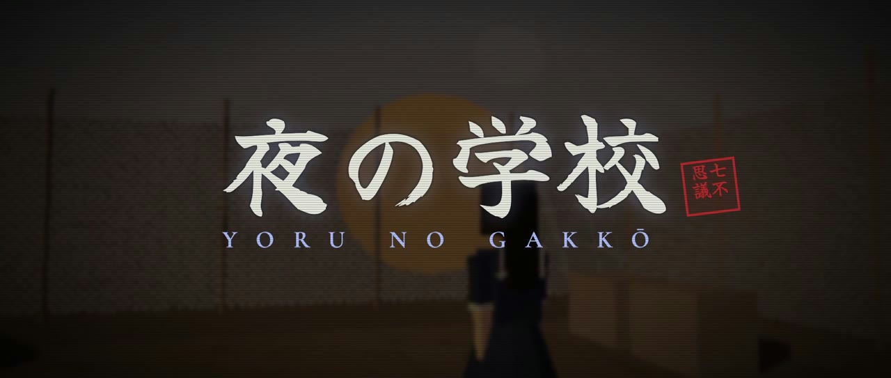
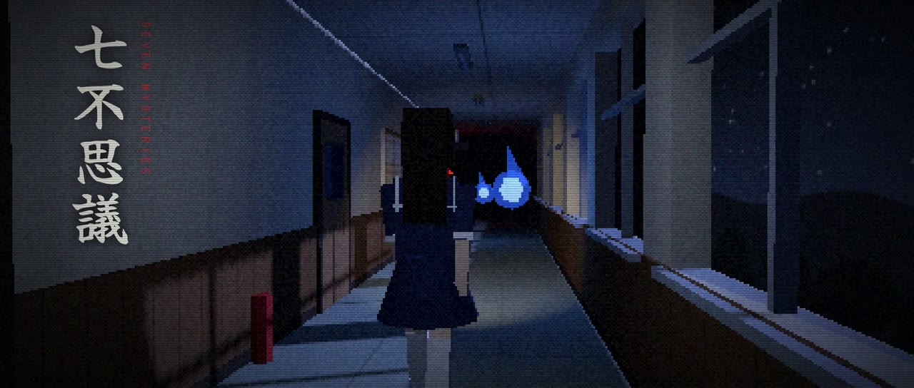
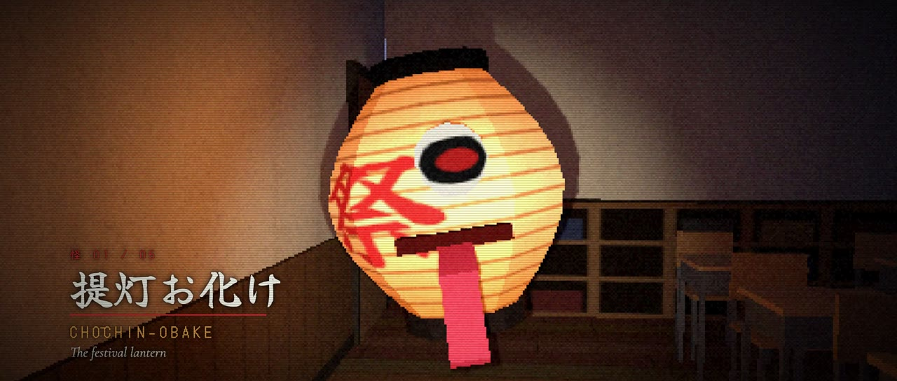
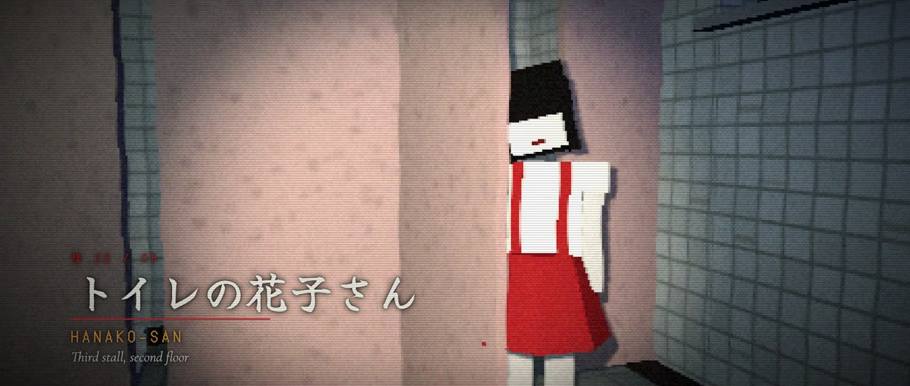
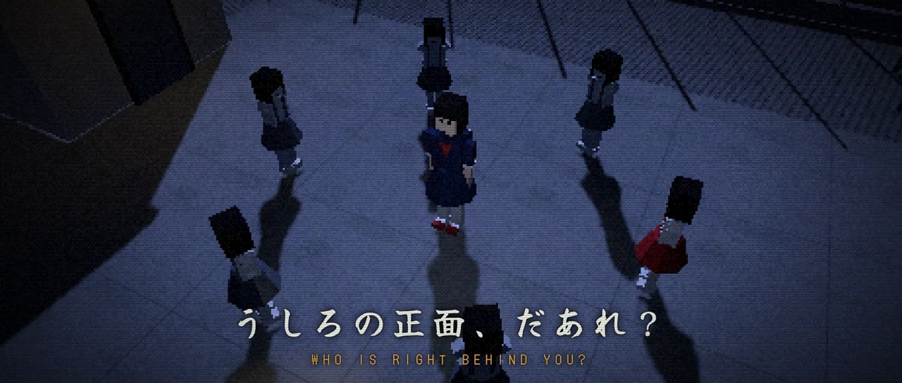
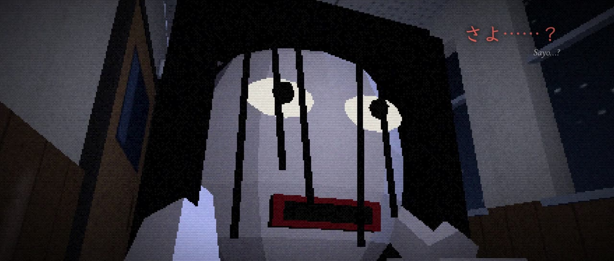
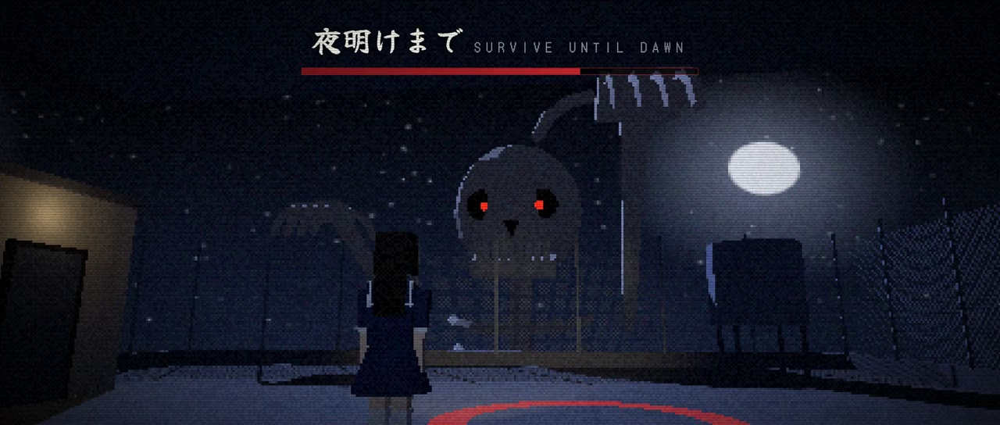

# 夜の学校 · Yoru no Gakkō

[English](README.md) · [简体中文](README.zh-CN.md) · [繁體中文](README.zh-TW.md) · **日本語**

**深夜二時の高校を舞台にした、レトロな固定カメラ型サバイバルホラー。**<br>七不思議。忘れられた、ひとつの名前。無料・オープンソースで、ブラウザですぐに遊べます。

### ▶ [今すぐプレイ](https://kantlex.github.io/yoru-no-gakko/)

最新情報は [X の @aisongman](https://x.com/aisongman) をフォローしてください。

https://github.com/user-attachments/assets/7e40b621-5d16-48e6-9546-7ed378a1f6b4

| | |
|---|---|
|  |  |
|  |  |
|  |  |

## ストーリー

> 放課後、剣道部の練習のあと、教室で眠ってしまった。
>
> 目が覚めると、午前二時だった。

どの学校にも「七不思議」がある。三番目の個室の少女、顔のない先生、肘をついて廊下を這ってくるもの。青嵐高校の七不思議は誰も覚えていないほど昔からあり、そして、ある理由のために書かれた。

夜明けまで生き延びて、七不思議を書いたのは誰なのか、そしてなぜ「名前」がそれほど大切なのかを確かめてください。ここから先はネタバレなしです。

## 特徴

- 初代『アローン・イン・ザ・ダーク』風の**固定カメラとラジコン操作**。480×300 の低解像度に、フラットシェーディング、ディザ、フィルムグレイン、ビネットを重ねて描画。
- 三つのフロアと体育館、屋上にまたがる**16の部屋**：教室、音楽室、保健室、理科室、図書室と書庫。
- ゾンビの代わりに**日本の妖怪と学校の怪談**：提灯お化け、トイレの花子さん、のっぺらぼう、ろくろ首、テケテケ、こっくりさん、がしゃどくろ。そして、頭だけで廊下を塞ぐほど巨大な大首女との追跡劇。
- **二幕・四章構成**。メモや日誌、古いクラス写真が、あなたの思っていた物語を少しずつ書き換えていく。
- 竹刀、清めの塩、お札で立ち向かい、おにぎり、ラムネ、包帯で持ちこたえる。
- **二言語表示**：日本語の下に英語、繁體中文、または简体中文。
- **主人公の声**：物語の要所で、主人公が16の短い日本語のセリフを話します（字幕つき）。
- **より豊かなサウンド**（すべてブラウザ内で合成）：部屋ごとの響き、廊下に反響する足音、屋上の風、遠くで鳴るチャイム。
- **設定**：明るさ、音楽・効果音・声の音量、文字の大きさ、操作方法、字幕の言語。
- **二つの操作方法**：クラシックなラジコン操作と、画面上で進みたい方向に入力するモダン操作。キーボード、タッチ、ゲームパッドに対応。
- **悪夢モード**：お化けは強く、物資は少なく、自動セーブもありません。セーブは学級日誌に書き込むことで行い、そのたびに鉛筆を一本使います。
- **記録と、もうひとつの結末**：七不思議、九つの資料、見た結末、最速タイムを記録。夜明けまでにすべての資料を読めば、この夜が隠していたものが見えてきます。
- ブラウザへの自動セーブ、スマホ・タブレット向けのタッチ操作。

## 操作方法

| 操作 | キーボード | ゲームパッド | タッチ |
|---|---|---|---|
| 移動・旋回 | 矢印キー / WASD | 左スティック / 十字キー | 十字キー |
| 走る | Shift | LT / B 長押し | 走（切り替え） |
| 調べる・操作する | E / Enter | A | 調 |
| 装備中のアイテムで攻撃 | Space | X / RT | 撃 |
| アイテム | I / Tab | Y | 持 |
| アイテム切り替え | Q | LB / RB | 替 |
| マップ | M | Back / View | |
| 戻る・閉じる | Backspace / Esc | B | |
| ポーズ | Esc / P | Start / Menu | ⏸ |

パソコンではラジコン操作、スマホではモダン操作が初期設定です。タイトル画面またはポーズメニューの「設定」から変更できます。

## ローカルで動かす

ゲームはビルドツールも依存パッケージのインストールも不要な、ひとつの HTML ページです。
Three.js は jsDelivr から、フォントは Google Fonts から読み込みます。

```sh
./build.sh                  # src/ を index.html にまとめる
python3 -m http.server 8000 # http://localhost:8000 を開く
```

ソースは `src/` に番号付きのパーツとして置かれ、`build.sh` が順番どおりにひとつの `<script type="module">` へ連結します。

| ファイル | 内容 |
|---|---|
| `00-head.html` | ページのマークアップ、CSS、UI オーバーレイ |
| `01-core.js` | レンダラー、低解像度ターゲットとポストシェーダー、入力、固定カメラ |
| `02-audio.js` | WebAudio による手続き生成サウンドと環境音 |
| `03-textures*.js` | Canvas で描いたテクスチャ |
| `04-models*.js` | 主人公とすべてのお化け（プリミティブで構成） |
| `05a-builder.js` | 部屋ビルダー：壁、窓、扉、当たり判定 |
| `05b`–`05e-rooms*.js` | 16の部屋 |
| `06a-state-ui.js` | ゲーム状態、アイテム、インベントリ、セーブ |
| `06b-actors.js` | 敵の挙動 |
| `06c-flow.js` | タイトル、導入、部屋の移動、ゲームオーバー、エンディング |
| `06d-act2.js` | 第二幕、追跡シーン、章タイトル |
| `06e-i18n.js` | 言語の切り替えと翻訳の参照 |
| `06f-settings.js` | 設定画面と保存される設定 |
| `06g-strings-zh.js` | 简体中文と繁體中文のテキスト |
| `06h-voice.js` | 主人公のボイスと字幕 |
| `06i-meta.js` | 周回をまたいで残る記録 |

## クレジットとライセンス

- コード：[MIT](LICENSE) © 2026 KantLex
- [three.js](https://threejs.org)（MIT）、jsDelivr から読み込み
- フォント：Google Fonts の Yuji Syuku、DotGothic16、Klee One、Noto Sans TC、Noto Sans SC（SIL Open Font License）
- 音楽と効果音はブラウザ内で手続き的に合成しています
- 主人公の日本語ボイス（`audio/voice/`）は ElevenLabs（eleven_v3）で生成しました。MIT ライセンスではなく ElevenLabs の規約が適用されます。
- 妖怪と七不思議は日本の民間伝承と学校の怪談に基づいています。登場人物、物語、学校はすべて架空のものです。
